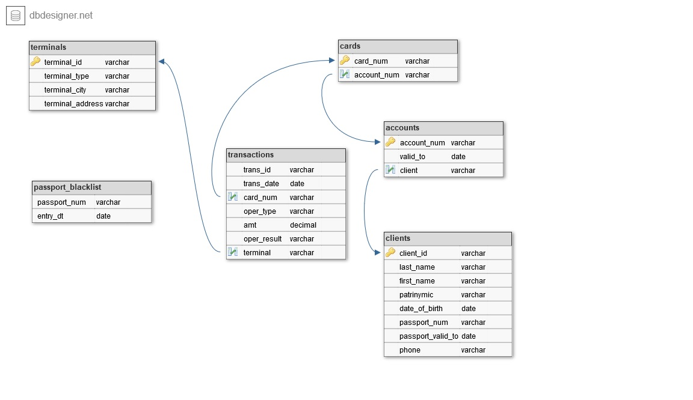

# Data Engineering (academical project)
*(перевод на русский язык см. после английского текста)*

Development of ETL process which daily captures data from several sources and uploads it to Oracle based DWH. In the DWH data is stored in SCD type 2 format. ETL script is automatically run at a Linux server at 3:30 a.m. every night. 
## **Data sources and ETL**
Nightly, transactional systems save data to a particular folder in the following formats:
1)	.csv file Bank cards transactions: only transactions per a particular date are included, i.e. one day = one file.
2)	.xlsx file containing list of cash machines (ATMs / terminals): list of ATMs is given “as per date”.
3)	.xlsx file “Black List” - list of IDs of individuals convicted of fraud. Cumulative data per month, i.e. IDs are added to the list during calendar month. New list is started from scratch in the consequent month.

It is assumed that one transactional system delivers only one file over one night. Once data from a file is captured to DWH filename is changed, i.e. “.backup” is appended to the filename. Renamed file is moved to “archive” subfolder. 

For instance, file transactions_DDMMYYYY.txt is renamed to transactions_DDMMYYYY.txt.backup.

Data on (1) clients (2) clients’ accounts and (3) clients' cards is stored in three separate tables of ORACLE database.

## **DWH**

DWH schema is on the below ERD. No primary keys are set in the DWH, in below ERD primary keys are given to illustrate relations between table only. Fields 'effective_from', 'effective_from', and 'deleted_flg' are added to tables storing non-transactional data 
 
 
 
## **Data Mart** 

Once data is loaded to DWH below data mart alerting on fraud actions is build. 

| Filed Name	| Description                                           |
|------------|-------------------------------------------------------|
| event_dt	  | Date of fraud suspicious action                       |
| passport	  | Passport number of individual suspected of fraud      |
| fio	       | Name of individual suspected of fraud                 |
| phone	     | Phone number                                          |
| event_type	| Fraud alarm reason (from list of “Red flags” below)   |
| report_dt	 | Reporting date (date when report was generated)       |
 
### Red flags (fraud alarms): 

  1.	Transaction is made by individual with expired passport or individual included to black list, 
  2.	Transaction within ineffective agreement,
  3.	Transactions are made in different cities within less than one hour.
  4.	Attempt of balance guessing, i.e. during 20 minutes more than 3 transactions are made wherein

      a.	Amount of each subsequent transaction is less then proceeding one
      
      b.	All transactions excluding the last one in a raw were declined and only the last one was successful.
 
The last one in such transactions raw is considered to be fraud.

## **Project’s structure**

| File or Folder name |     Type    | Description                                                          |
| ------------------- | ----------- | -------------------------------------------------------------------- |
| main.py             |     file    | ETL script                                                           |
| main.cron           |     file    | File in crontab format launching ETL script every night at 3:30 a.m. |
| Files               |     file    | Sample files from transactional systems                              |
| sql_scripts         |    folder   | SQL scripts used by main.py                                          |
| py_scripts          |    folder   | Python scripts used by main.py                                       |
| DDL_script          |     file    | DDL script creating DWH                                              |
  
  # Учебный проект по курсу Data Engineering 
Построение DWH на основе БД Oracle, разработка ETL процесса, получающего ежедневную выгрузку данных из транзакционных систем и загружающего ее в данное хранилище и ежедневно строящего отчет о действиях, содержащих признаки мошенничества

## **Источники данных и ETL-процесс**
Ежедневно транзакционные системы выгружают три следующих файла:

1. Список транзакций за текущий день. Формат – CSV.
2. Список терминалов полным срезом. Формат – XLSX.
3. Список паспортов, включенных в «черный список» - с накоплением с начала месяца. Формат – XLSX.

Сведения о (1) картах, (2) счетах и (3)клиентах хранятся в СУБД Oracle.

Предполагается, что транзакционные системы сохраняют ежедневно по одному файлу в определенную папку. После загрузки файла, он должен быть переименован (добавлено расширение .backup) и перемещен в каталог archive, чтобы при следующем запуске файл не загружался повторно.
Например, файл transactions_DDMMYYYY.txt переименовывается в transactions_DDMMYYYY.txt.backup.

## **Структура хранилища**

Схема хранилища приведена на ERD ниже. Первичные ключи в хранилище не устанавливаются, на ERD они приведены только для иллюстрации связей между таблицами. В таблицы нетранзакционнных данных также добавлены поля effective_from, effective_from и deleted_flg.
 
 
## **Построение отчета** 
По результатам загрузки ежедневно строится витрина отчетности операций, содержащих признаки мошенничества. Витрина строится накоплением, каждый новый отчет сохраняется в эту же таблицу с новым report_dt. В витрине содержатся следующие поля:

|  Filed Name	| Описание                                                          |
|-------------|-------------------------------------------------------------------| 
|  event_dt	  | Дата подозрительного действия                                     |
|  passport	  | Номер паспорта человека, заподозренного в мошеннических действиях |
|  fio	       | Имя человека, заподозренного в мошенничиских действиях            |
|  phone	     | телефонный номер                                                  |
|  event_type	| описание мошеннического действия (из списка “Red flags” ниже)     |
|  report_dt	 | Дата построения отчета                                            |

Признаки мошеннических операций.
1. Совершение операции при просроченном или заблокированном паспорте.
2. Совершение операции при недействующем договоре.
3. Совершение операций в разных городах в течение одного часа.
4. Попытка подбора суммы. В течение 20 минут проходит более 3х операций со следующим шаблоном – каждая последующая меньше предыдущей, при этом отклонены все кроме последней. Последняя операция (успешная) в такой цепочке считается мошеннической.

## **Структура проекта**

|  Имя файла / папки  |     Тип     | Описание                                                             |
| ------------------- | ----------- | -------------------------------------------------------------------- |
| main.py             |     файл    | ETL скрипт                                                           |
| main.cron           |     файл    | Файл для постановки процесса на расписание в формате crontab         |
| Files               |     файл    | Sample files from transactional systems for 3 days                   |
| sql_scripts         |    папка    | SQL запросы, запускаемые файлом main.py                              |
| py_scripts          |    папка    | Python скрипты, запускаемые файлом main.py                           |
| DDL_script          |     файл    | DDL скрипт создания DWH                                         |
  
